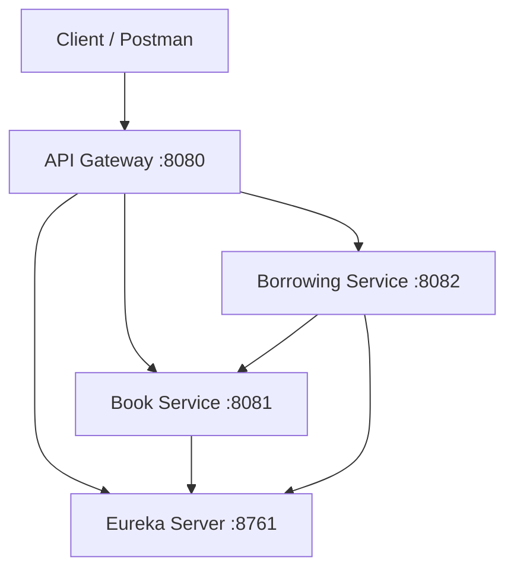

# Library Microservices

A distributed library backend built as a university Distributed Systems course project. The system separates book inventory and borrowing into independent Spring Boot services, discovers service instances through Eureka, and exposes one public API through Spring Cloud Gateway.

The complete workflow was tested with Postman and received full marks for the course submission. This repository keeps the original application behavior while adding reproducible builds, focused unit tests, CI, and project documentation.

## What it demonstrates

- Service registration and discovery with Netflix Eureka
- API routing through Spring Cloud Gateway
- Service-to-service calls using a load-balanced `RestTemplate`
- Database ownership per service using separate H2 databases
- RESTful CRUD operations and input validation
- Borrowing, returns, availability updates, overdue detection, and late fees
- A multi-module Maven build and automated GitHub Actions verification

## Architecture



| Component | Port | Responsibility |
| --- | ---: | --- |
| Eureka Server | `8761` | Service registry and discovery dashboard |
| API Gateway | `8080` | Public entry point and request routing |
| Book Service | `8081` | Book catalog, inventory, and availability |
| Borrowing Service | `8082` | Borrowing records, returns, overdue status, and late fees |

See [Architecture and design](docs/architecture.md) for the request flows and consistency boundaries.

## Technology

- Java 17
- Spring Boot 3.5.14
- Spring Cloud 2025.0.2
- Spring Cloud Gateway MVC
- Netflix Eureka
- Spring Data JPA
- H2 in-memory databases
- Maven Wrapper 3.9.14
- JUnit 5 and Mockito

## Prerequisites

- JDK 17
- Internet access on the first build so Maven can download dependencies
- Postman only if you want to import and run the included collection

No external database or separately installed Maven is required.

## Build and test

From the repository root:

```powershell
.\mvnw.cmd clean verify
```

On macOS or Linux:

```bash
./mvnw clean verify
```

The root `pom.xml` builds and tests all four applications. GitHub Actions runs the same verification for pushes and pull requests.

## Run locally

Start each application in a separate terminal and keep every terminal open. Start them in this order.

### 1. Eureka Server

```powershell
.\mvnw.cmd -pl eureka-server spring-boot:run
```

Wait for `Started EurekaServerApplication`, then open <http://localhost:8761>.

### 2. Book Service

```powershell
.\mvnw.cmd -pl book-service spring-boot:run
```

### 3. Borrowing Service

```powershell
.\mvnw.cmd -pl borrowing-service spring-boot:run
```

### 4. API Gateway

```powershell
.\mvnw.cmd -pl api-gateway spring-boot:run
```

After registration, the Eureka dashboard should show `BOOK-SERVICE`, `BORROWING-SERVICE`, and `API-GATEWAY`.

Verify the public API:

```text
GET http://localhost:8080/api/books
```

A new system returns an empty JSON array: `[]`.

## Reproduce the Postman demo

Import [`postman/Library-Microservices.postman_collection.json`](postman/Library-Microservices.postman_collection.json) into Postman. The collection contains an ordered end-to-end flow that:

1. Checks Gateway health.
2. Creates a sample book.
3. Retrieves the book catalog.
4. Borrows the sample book and stores the generated borrowing ID.
5. Confirms the active borrowing.
6. Returns the book.
7. Confirms the member's borrowing history.
8. Removes the sample book.

Run the services first, then run the collection from a fresh application start.

## Databases

The project intentionally uses two independent in-memory H2 databases:

| Service | Console | JDBC URL | User | Password |
| --- | --- | --- | --- | --- |
| Book Service | <http://localhost:8081/h2-console> | `jdbc:h2:mem:bookdb` | `sa` | blank |
| Borrowing Service | <http://localhost:8082/h2-console> | `jdbc:h2:mem:borrowingdb` | `sa` | blank |

Data is cleared whenever its owning service stops. This keeps the course project self-contained and easy to demonstrate.

## API documentation

All routes and example payloads are documented in [API reference](docs/api.md). Clients should normally use the Gateway base URL:

```text
http://localhost:8080
```

## Current scope

This is an educational microservices prototype rather than a production library system. It does not include authentication, a member service, persistent storage, distributed transactions, retries, or concurrency control for the final available copy. Those boundaries are documented rather than hidden because they are useful distributed-systems design considerations.
