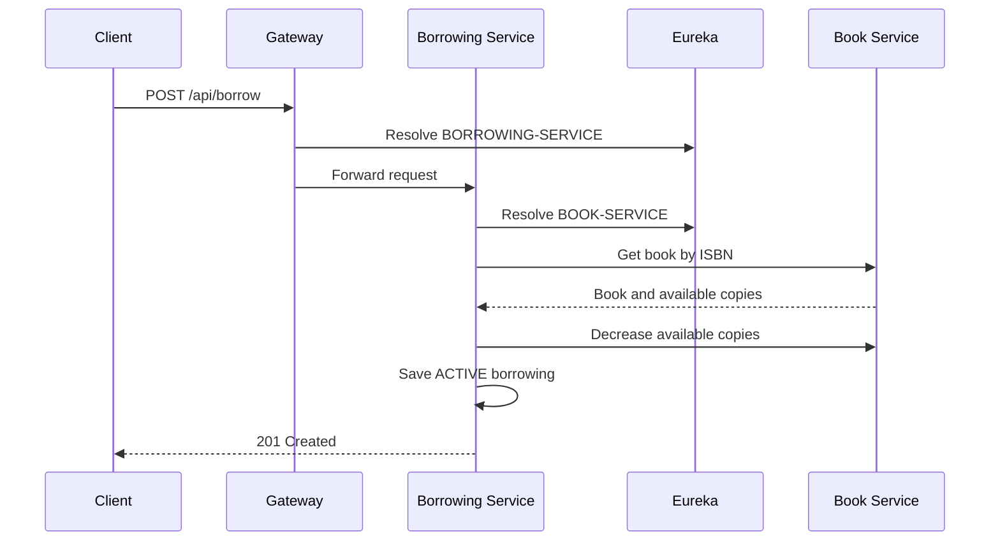

# Architecture and Design

## Service responsibilities

The project uses four independently runnable Spring Boot applications. Each application owns one responsibility and communicates over HTTP.

| Service | Owns | Does not own |
| --- | --- | --- |
| Eureka Server | Runtime service registry | Business data |
| API Gateway | Public routing rules | Books or borrowing records |
| Book Service | Book metadata and copy availability | Member borrowing history |
| Borrowing Service | Borrowing lifecycle and late fees | Book metadata or inventory |

The services use their configured `spring.application.name` values as logical network names. Eureka maps those names to currently running instances.

## Borrowing flow

If dates are omitted, Borrowing Service uses the current date and sets the due date to 14 days later.

## Return flow

Borrowing Service loads the borrowing record, calculates overdue days, asks Book Service to increase available copies, and then marks the borrowing as `RETURNED`. The late fee is `1.0` per day after the due date.

## Data ownership

Book Service uses `jdbc:h2:mem:bookdb`. Borrowing Service uses `jdbc:h2:mem:borrowingdb`. No service reads another service's database directly. Borrowing Service obtains book information through Book Service's REST API, which preserves the service boundary.

The databases are in memory, so their contents disappear when the applications stop. This is appropriate for a repeatable classroom demonstration but would be replaced with durable databases in production.

## Consistency boundary

Borrowing spans two separate services:

1. Book Service decreases availability.
2. Borrowing Service saves the borrowing record.

Those actions are not one database transaction. If the second action fails after the first succeeds, inventory and borrowing history can temporarily disagree. Returning a book has the same boundary in reverse.

A production evolution could address this with an event-driven saga, compensating operations, idempotency keys, retries, and optimistic locking around inventory. The current synchronous design remains intentionally small and explainable for the course scope.

## Gateway routes

The Gateway resolves destinations through Eureka rather than fixed host-and-port addresses:

- `/api/books` and `/api/books/**` route to `lb://BOOK-SERVICE`.
- `/api/borrow` and `/api/borrow/**` route to `lb://BORROWING-SERVICE`.

If a destination is absent from Eureka, the corresponding Gateway request cannot be completed. This is why the recommended startup order begins with Eureka.
